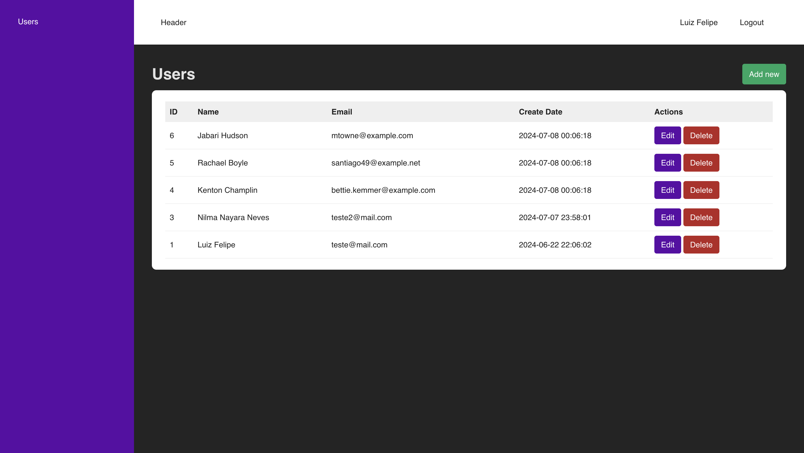

## User Management System with Laravel, React, and Docker

This application is a user management system using React for the front-end and Axios for communication with the back-end. We will cover creating routes, views, components, contexts, and configuring Axios. By the end, you will have a functional system with features for user login, registration, listing, editing, and deletion.

The application dive into following points: 

📌 Building a powerful front-end application with React

📌 Efficient navigation techniques using react-router-dom

📌 Utilizing the Context API to provide essential user information

📌 Effective communication with the back-end via Axios

📌 Developing a robust back-end application with Laravel

📌 Creating a REST API to manage user data with precision

## Prerequisites

Before we begin with the installation of Laravel and React using Docker, you need to have Docker installed on your machine. We will show you how to install Docker Desktop, a user-friendly tool for managing your Docker containers.

#### Step 1: Downloading Docker Desktop

1. Visit the official Docker website.

2. Click on the “Download Docker Desktop” button.

3. Choose the appropriate version for your operating system (Windows, macOS, or Linux).

#### Step 2: Installing Docker Desktop

1. After downloading, open the installer and follow the on-screen instructions.

   For Windows: The installer will prompt you to enable WSL 2 (Windows Subsystem for Linux 2) integration, which is recommended for better performance.

   For macOS: Drag the Docker icon to the Applications folder.

   For Linux: Follow the specific installation instructions for your distribution (this usually involves adding the Docker repository and installing via the package manager).

2. After installation, open Docker Desktop. It may request additional permissions for setup and execution.

3. Verify the installation by opening a terminal and running the command:

#### Step 3: Node
You must have node installed in your machine for install dependencies.

### Installing Dependencies

`` 
    npm install
``

